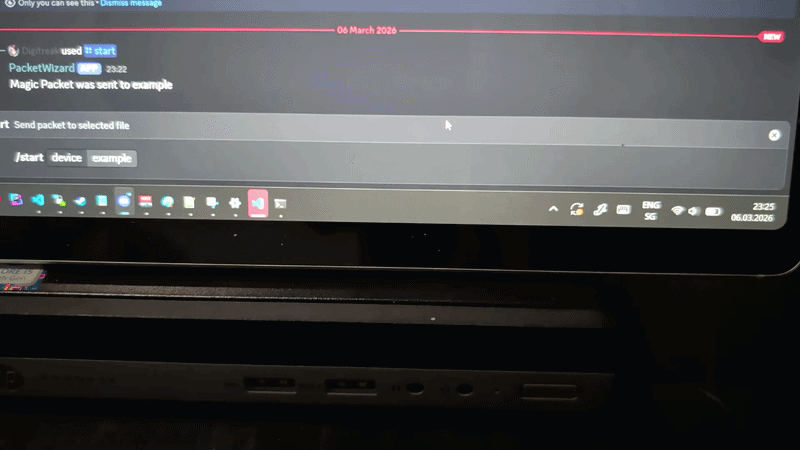

# PacketWizard – Discord Wake-on-LAN Bot

## Demo

  

IMPORTANT:
This bot must be self-hosted.

The Wake-on-LAN (WOL) packet is sent from the machine where the bot is running.
If you host it on a VPS or cloud server, the packet will be sent from there
and will usually NOT wake devices inside your local network.

Run this bot on:
- A PC inside your LAN
- A home server
- A Raspberry Pi inside your network

--------------------------------------------------
WHAT THIS BOT DOES
--------------------------------------------------

- Sends Wake-on-LAN (WOL) packets via Discord slash commands
- Stores devices as simple text files
- Validates MAC address, IP address, and port
- Uses default IP (255.255.255.255) and port (9) if not provided

--------------------------------------------------
REQUIREMENTS
--------------------------------------------------

Python 3.10+

Install dependencies:

pip install discord.py wakeonlan python-dotenv

--------------------------------------------------
SETUP
--------------------------------------------------

1) Create a Discord Bot
   - Go to Discord Developer Portal
   - Create Application
   - Add Bot
   - Copy Bot Token
   - Enable:
     - bot
     - applications.commands

2) Create a .env file in project root:

DISCORD_TOKEN=your_bot_token_here

3) Create required folder:

devices

--------------------------------------------------
IMPORTANT PROJECT STRUCTURE
--------------------------------------------------

bot.py
.env
/devices/

--------------------------------------------------
DEVICE FILE FORMAT
--------------------------------------------------

Each device is stored as a file inside the "devices" folder.

Example file: devices/server1

mac_addr=AA:BB:CC:DD:EE:FF
ip_addr=255.255.255.255
port_addr=9

Required:
- mac_addr

Optional:
- ip_addr (default = 255.255.255.255)
- port_addr (default = 9)

--------------------------------------------------
RUNNING THE BOT
--------------------------------------------------

python bot.py

--------------------------------------------------
SLASH COMMANDS
--------------------------------------------------

/files
Lists all saved device files inside /devices

/start device:<filename>
Sends WOL packet using saved device file

Example:
/start device:server1

/custom mac:<mac> ip:<optional> port:<optional>
Sends WOL packet manually without a saved file

Example:
/custom mac:AA:BB:CC:DD:EE:FF

Example with custom IP:
/custom mac:AA:BB:CC:DD:EE:FF ip:192.168.1.255 port:9

/create device_name:<name> mac:<mac> ip:<optional> port:<optional>
Creates a new device file inside /devices

Example:
/create device_name:server1 mac:AA:BB:CC:DD:EE:FF

--------------------------------------------------
NOTES
--------------------------------------------------

- Target device must have Wake-on-LAN enabled in BIOS
- Network adapter must support WOL
- Device must be reachable via broadcast inside the same network
- Do NOT upload your .env file to GitHub
- Restrict command usage with Discord role permissions if needed